> 🌎 Language Options:
>
> - [Português Brasileiro](docs/pt-br/README.md)
> - English (current)

This document provides a detailed overview of the CI/CD workflow configured for the deScier platform. Here you'll find a step-by-step explanation of the entire process, from repository push to AWS deployment, along with a flow diagram to aid understanding.

## Table of Contents

- [Overview](#overview)
- [Flow Diagram](#flow-diagram)
- [CI/CD Workflow](#cicd-workflow)
  - [1. Repository Push](#1-repository-push)
  - [2. GitHub Actions Workflow Start](#2-github-actions-workflow-start)
  - [3. Build Environment Setup](#3-build-environment-setup)
  - [4. Docker Image Build and Push](#4-docker-image-build-and-push)
  - [5. Amazon ECS Deployment](#5-amazon-ecs-deployment)

## Overview

The deScier platform uses an automated CI/CD pipeline to ensure code changes are continuously integrated and reliably deployed. The process is orchestrated by [GitHub Actions](https://github.com/deScier/deSci-platform/actions) and utilizes AWS services, including [Amazon ECR (Elastic Container Registry)](https://aws.amazon.com/ecr/) and [Amazon ECS (Elastic Container Service)](https://docs.aws.amazon.com/AmazonECS/latest/developerguide/Welcome.html).

## Flow Diagram

To visualize the entire process, see the flow diagram below:

```mermaid
flowchart TD
    subgraph Developer
        A[Repository Push] --> |branch: develop| B[GitHub Repository]
        A2[Repository Push] --> |branch: main| B
    end

    subgraph "GitHub Actions Flow"
        B --> |branch develop| C1[Trigger Dev Workflow]
        B --> |branch main| C2[Trigger Prod Workflow]

        subgraph "Setup Phase"
            C1 --> D1[Repository Checkout]
            C2 --> D2[Repository Checkout]
            D1 & D2 --> E[Setup QEMU]
            E --> F[Setup Docker Buildx]
        end

        subgraph "AWS Authentication"
            F --> G[Configure AWS Credentials]
            G --> H[ECR Login]
            H --> I[Get ECR Repository URI]
        end

        subgraph "Secrets Management"
            I --> J[Fetch AWS Secrets Manager Secrets]
            J --> K[Create .env file]
        end

        subgraph "Docker Build and Push"
            K --> L[Build Docker Image]
            L --> M[Tag Image with ECR URI]
            M --> N[Push to Amazon ECR]
        end

        subgraph "ECS Deployment"
            N --> |develop| O1[Dev Task Definition]
            N --> |main| O2[Prod Task Definition]
            O1 --> P1[Update Dev Image]
            O2 --> P2[Update Prod Image]
            P1 --> Q1[Register Dev Task]
            P2 --> Q2[Register Prod Task]
            Q1 --> R1[Update Dev Service]
            Q2 --> R2[Update Prod Service]
            R1 & R2 --> S[Wait for Service Stability]
        end
    end

    subgraph "AWS Infrastructure"
        S --> T[Amazon ECR]
        T --> |develop| U1[ECS Dev Cluster]
        T --> |main| U2[ECS Prod Cluster]
        U1 --> V1[ECS Dev Service]
        U2 --> V2[ECS Prod Service]
        V1 --> W1[Dev Tasks]
        V2 --> W2[Prod Tasks]
        W1 --> X1[Dev Containers]
        W2 --> X2[Prod Containers]
    end

    subgraph "Public Access"
        X1 --> Y1[dev.desci.reviews]
        X2 --> Y2[platform.desci.reviews]
    end

    classDef setup fill:#fff,stroke:#333,color:#333,stroke-width:2px
    classDef aws fill:#ff9900,color:#000
    classDef container fill:#4065a9,color:#fff
    classDef domain fill:#70468c,color:#fff

    class A,A2,B setup
    class T,U1,U2,V1,V2,W1,W2 aws
    class L,M,N container
    class Y1,Y2 domain
```



## CI/CD Workflow

### 1. Repository Push

When developers push changes to the `develop` branch of the `deSci-platform` repository on GitHub, it triggers the CI/CD pipeline.

### 2. GitHub Actions Workflow Start

[GitHub Actions](https://github.com/deScier/deSci-platform/actions) detects the push event and initiates the workflow defined in the [`.github/workflows/cd.yml`](https://github.com/deScier/deSci-platform/blob/main/.github/workflows/cd.yml) file. This workflow automates the entire build and deployment process.

### 3. Build Environment Setup

**a. Code Checkout**

The first step is to clone the repository to the build environment:

```yaml
- name: Code checkout
  uses: actions/checkout@v3
```

**b. QEMU and Buildx Setup**

These steps configure the [QEMU](https://www.qemu.org/) emulator and [Docker Buildx](https://docs.docker.com/buildx/working-with-buildx/) to enable multi-platform Docker image building:

```yaml
- name: Set up QEMU
  uses: docker/setup-qemu-action@v2

- name: Set up Docker Buildx
  uses: docker/setup-buildx-action@v2
```

**c. AWS Credentials Setup**

Configures AWS credentials using secrets stored in GitHub:

```yaml
- name: Configure AWS credentials
  uses: aws-actions/configure-aws-credentials@v2
  with:
    aws-access-key-id: ${{ secrets.AWS_ACCESS_KEY_ID }}
    aws-secret-access-key: ${{ secrets.AWS_SECRET_ACCESS_KEY }}
    aws-region: ${{ secrets.AWS_REGION }}
```

**d. Amazon ECR Login**

Authenticates with Amazon ECR container registry:

```yaml
- name: Login to Amazon ECR
  uses: aws-actions/amazon-ecr-login@v2
```

**e. ECR Repository URI Retrieval**

Retrieves the full URI of the ECR repository where the Docker image will be pushed:

```yaml
- name: Get ECR repository URI
  id: ecr
  run: |
    echo "::set-output name=uri::$(aws ecr describe-repositories --repository-names $ECR_REPOSITORY_DEV --query 'repositories[0].repositoryUri' --output text)"
```

**f. AWS Secrets Manager Secrets Retrieval**

Obtains the necessary secrets for the application and saves them to a `.env` file:

```yaml
- name: Retrieve AWS Secrets Manager secrets
  run: |
    aws secretsmanager get-secret-value --secret-id $ENV_SECRET_NAME_DEV --query SecretString --output text > .env
```

**Note:** Secrets are kept secure and not displayed in logs.

### 4. Docker Image Build and Push

**a. Docker Image Build**

The Docker image is built using the `Dockerfile`, passing the `.env` file content as a build argument:

```yaml
- name: Build Docker image
  run: |
    docker build --build-arg ENV_FILE="$(cat .env)" -t ${{ steps.ecr.outputs.uri }}:latest .
```

**b. Push to Amazon ECR**

After building, the image is pushed to Amazon ECR:

```yaml
- name: Push image to Amazon ECR
  run: |
    docker push ${{ steps.ecr.outputs.uri }}:latest
```

### 5. Amazon ECS Deployment

**a. Task Definition Update**

- Downloads the current ECS task definition:

```yaml
- name: Download current ECS task definition
  run: |
    aws ecs describe-task-definition --task-definition $ECS_TASK_DEV_NAME > task-definition.json
```

- Updates the image in the task definition:

```yaml
- name: Update image in task definition
  run: |
    sed -i 's#<IMAGE_NAME>#${{ steps.ecr.outputs.uri }}:latest#g' task-definition.json
```

- Registers the new task definition in ECS:

```yaml
- name: Register new task definition in ECS
  run: |
    aws ecs register-task-definition --cli-input-json file://task-definition.json
```

**b. ECS Service Update**

Updates the ECS service to use the new task definition:

```yaml
- name: Update ECS service
  uses: aws-actions/amazon-ecs-deploy-task-definition@v2
  with:
    task-definition: task-definition.json
    service: ${{ env.ECS_SERVICE_DEV }}
    cluster: ${{ env.ECS_CLUSTER_DEV }}
    wait-for-service-stability: true
```

**c. Amazon ECR Logout**

For security, logs out from Amazon ECR:

```yaml
- name: Logout from Amazon ECR
  run: |
    docker logout ${{ steps.ecr.outputs.uri }}
```
