# Pipeline de CI/CD para a Plataforma deSci

Este documento fornece uma visão detalhada do fluxo de trabalho de CI/CD configurado para a plataforma deScier. Aqui você encontrará uma explicação passo a passo de todo o processo, desde o push no repositório até a implantação na AWS, juntamente com um diagrama de fluxo para auxiliar na compreensão.

## Sumário

- [Visão Geral](#visão-geral)
- [Diagrama de Fluxo](#diagrama-de-fluxo)
- [Fluxo de Trabalho do CI/CD](#fluxo-de-trabalho-do-cicd)
  - [1. Push no Repositório](#1-push-no-repositório)
  - [2. Início do Workflow no GitHub Actions](#2-início-do-workflow-no-github-actions)
  - [3. Configuração do Ambiente de Build](#3-configuração-do-ambiente-de-build)
  - [4. Construção e Push da Imagem Docker](#4-construção-e-push-da-imagem-docker)
  - [5. Implantação no Amazon ECS](#5-implantação-no-amazon-ecs)
- [Detalhes Adicionais](#detalhes-adicionais)
  - [Dockerfile Personalizado](#dockerfile-personalizado)
  - [Segurança e Boas Práticas](#segurança-e-boas-práticas)

## Visão Geral

A plataforma deScier utiliza um pipeline de CI/CD automatizado para garantir que as alterações de código sejam integradas e implantadas de forma contínua e confiável. O processo é orquestrado pelo GitHub Actions e faz uso dos serviços da AWS, incluindo o [Amazon ECR (Elastic Container Registry)](https://aws.amazon.com/pt/ecr/#:~:text=O%20Amazon%20Elastic%20Container%20Registry,forma%20confi%C3%A1vel%20em%20qualquer%20lugar.) e o [Amazon ECS (Elastic Container Service)](https://docs.aws.amazon.com/pt_br/AmazonECS/latest/developerguide/Welcome.html).

## Diagrama de Fluxo

Para visualizar todo o processo, veja o diagrama de fluxo abaixo:

```mermaid
flowchart TD
    subgraph Desenvolvedor
        A[Push para Repositório] --> |branch: develop| B[Repositório GitHub]
        A2[Push para Repositório] --> |branch: main| B
    end

    subgraph "Fluxo do GitHub Actions"
        B --> |branch develop| C1[Dispara Workflow Dev]
        B --> |branch main| C2[Dispara Workflow Prod]

        subgraph "Fase de Configuração"
            C1 --> D1[Checkout do Repositório]
            C2 --> D2[Checkout do Repositório]
            D1 & D2 --> E[Configurar QEMU]
            E --> F[Configurar Docker Buildx]
        end

        subgraph "Autenticação AWS"
            F --> G[Configurar Credenciais AWS]
            G --> H[Login no ECR]
            H --> I[Obter URI do Repositório ECR]
        end

        subgraph "Gerenciamento de Segredos"
            I --> J[Buscar Segredos do AWS Secrets Manager]
            J --> K[Criar arquivo .env]
        end

        subgraph "Build e Push Docker"
            K --> L[Construir Imagem Docker]
            L --> M[Marcar Imagem com URI do ECR]
            M --> N[Push para Amazon ECR]
        end

        subgraph "Implantação ECS"
            N --> |develop| O1[Definição de Tarefa Dev]
            N --> |main| O2[Definição de Tarefa Prod]
            O1 --> P1[Atualizar Imagem Dev]
            O2 --> P2[Atualizar Imagem Prod]
            P1 --> Q1[Registrar Tarefa Dev]
            P2 --> Q2[Registrar Tarefa Prod]
            Q1 --> R1[Atualizar Serviço Dev]
            Q2 --> R2[Atualizar Serviço Prod]
            R1 & R2 --> S[Aguardar Estabilidade do Serviço]
        end
    end

    subgraph "Infraestrutura AWS"
        S --> T[Amazon ECR]
        T --> |develop| U1[Cluster ECS Dev]
        T --> |main| U2[Cluster ECS Prod]
        U1 --> V1[Serviço ECS Dev]
        U2 --> V2[Serviço ECS Prod]
        V1 --> W1[Tarefas Dev]
        V2 --> W2[Tarefas Prod]
        W1 --> X1[Contêineres Dev]
        W2 --> X2[Contêineres Prod]
    end

    subgraph "Acesso Público"
        X1 --> Y1[dev.desci.reviews]
        X2 --> Y2[platform.desci.reviews]
    end

    classDef setup fill:#fff,stroke:#333,color:#333,stroke-width:2px
    classDef aws fill:#ff9900,color:#000
    classDef container fill:#4065a9,color:#fff
    classDef domain fill:#70468c,color:#fff

    class A,A2,B setup
    class T,U1,U2,V1,V2,W1,W2 aws
    class L,M,N container
    class Y1,Y2 domain
```



## Fluxo de Trabalho do CI/CD

### 1. Push no Repositório

Quando os desenvolvedores fazem push de alterações para o branch `develop` do repositório `deSci-platform` no GitHub, isso aciona o pipeline de CI/CD.

### 2. Início do Workflow no GitHub Actions

O GitHub Actions detecta o evento de push e inicia o workflow definido no arquivo `.github/workflows/cd.yml`. Este workflow automatiza todo o processo de build e implantação.

### 3. Configuração do Ambiente de Build

**a. Checkout do Código**

O primeiro passo é clonar o repositório para o ambiente de build:

```yaml
- name: Checkout do código
  uses: actions/checkout@v3
```

**b. Configuração do QEMU e Buildx**

Estas etapas configuram o emulador [QEMU](https://blog.infnet.com.br/virtualizacao/qemu-o-que-e-e-como-usar/) e o [Docker Buildx](https://awari.com.br/docker-buildx-aumentando-a-eficiencia-no-desenvolvimento-de-aplicacoes/?utm_source=blog&utm_campaign=projeto+blog&utm_medium=Docker%20Buildx:%20Aumentando%20a%20Efici%C3%AAncia%20no%20Desenvolvimento%20de%20Aplica%C3%A7%C3%B5es#:~:text=O%20Docker%20Buildx%20%C3%A9%20uma%20ferramenta%20avan%C3%A7ada%20que%20oferece%20recursos,constru%C3%A7%C3%A3o%20e%20desenvolvimento%20de%20aplica%C3%A7%C3%B5es.) para permitir a construção de imagens Docker multiplataforma:

```yaml
- name: Configurar QEMU
  uses: docker/setup-qemu-action@v2

- name: Configurar Docker Buildx
  uses: docker/setup-buildx-action@v2
```

**c. Configuração das Credenciais AWS**

Configura as credenciais AWS usando os secrets armazenados no GitHub:

```yaml
- name: Configurar credenciais AWS
  uses: aws-actions/configure-aws-credentials@v2
  with:
    aws-access-key-id: ${{ secrets.AWS_ACCESS_KEY_ID }}
    aws-secret-access-key: ${{ secrets.AWS_SECRET_ACCESS_KEY }}
    aws-region: ${{ secrets.AWS_REGION }}
```

**d. Login no Amazon ECR**

Autentica no registro de contêiner do Amazon ECR:

```yaml
- name: Fazer login no Amazon ECR
  uses: aws-actions/amazon-ecr-login@v2
```

**e. Obtenção do URI do Repositório ECR**

Recupera o URI completo do repositório ECR para onde a imagem Docker será enviada:

```yaml
- name: Obter URI do repositório ECR
  id: ecr
  run: |
    echo "::set-output name=uri::$(aws ecr describe-repositories --repository-names $ECR_REPOSITORY_DEV --query 'repositories[0].repositoryUri' --output text)"
```

**f. Recuperação de Segredos do AWS Secrets Manager**

Obtém os segredos necessários para a aplicação e os salva em um arquivo `.env`:

```yaml
- name: Recuperar segredos do AWS Secrets Manager
  run: |
    aws secretsmanager get-secret-value --secret-id $ENV_SECRET_NAME_DEV --query SecretString --output text > .env
```

**Nota:** Os segredos são mantidos seguros e não são exibidos nos logs.

### 4. Construção e Push da Imagem Docker

**a. Construção da Imagem Docker**

A imagem Docker é construída usando o `Dockerfile`, passando o conteúdo do arquivo `.env` como um argumento de build:

```yaml
- name: Construir a imagem Docker
  run: |
    docker build --build-arg ENV_FILE="$(cat .env)" -t ${{ steps.ecr.outputs.uri }}:latest .
```

**b. Push da Imagem para o Amazon ECR**

Após a construção, a imagem é enviada para o Amazon ECR:

```yaml
- name: Fazer push da imagem para o Amazon ECR
  run: |
    docker push ${{ steps.ecr.outputs.uri }}:latest
```

### 5. Implantação no Amazon ECS

**a. Atualização da Definição de Tarefa**

- Baixa a definição de tarefa atual do ECS:

```yaml
- name: Baixar definição de tarefa atual do ECS
  run: |
    aws ecs describe-task-definition --task-definition $ECS_TASK_DEV_NAME > task-definition.json
```

- Atualiza a imagem na definição de tarefa:

```yaml
- name: Atualizar imagem na definição de tarefa
  run: |
    sed -i 's#<IMAGE_NAME>#${{ steps.ecr.outputs.uri }}:latest#g' task-definition.json
```

- Registra a nova definição de tarefa no ECS:

```yaml
- name: Registrar nova definição de tarefa no ECS
  run: |
    aws ecs register-task-definition --cli-input-json file://task-definition.json
```

**b. Atualização do Serviço ECS**

Atualiza o serviço no ECS para usar a nova definição de tarefa:

```yaml
- name: Atualizar serviço no ECS
  uses: aws-actions/amazon-ecs-deploy-task-definition@v2
  with:
    task-definition: task-definition.json
    service: ${{ env.ECS_SERVICE_DEV }}
    cluster: ${{ env.ECS_CLUSTER_DEV }}
    wait-for-service-stability: true
```

**c. Logout do Amazon ECR**

Por segurança, encerra a sessão com o Amazon ECR:

```yaml
- name: Logout do Amazon ECR
  run: |
    docker logout ${{ steps.ecr.outputs.uri }}
```

## Detalhes Adicionais

### Dockerfile Personalizado

O `Dockerfile` foi projetado para incorporar o arquivo `.env` diretamente durante a construção da imagem, garantindo que as variáveis de ambiente necessárias estejam presentes no contêiner sem expor informações sensíveis nos logs.

```dockerfile
FROM node:18-alpine

WORKDIR /app

# Aceita o argumento de build para o conteúdo do .env
ARG ENV_FILE

# Escreve o conteúdo do ENV_FILE no .env dentro do contêiner
RUN sh -c 'echo "$ENV_FILE" > .env'

# Copia package.json e instala as dependências
COPY package*.json ./
RUN npm install

# Copia o restante da aplicação
COPY . .

# Constrói a aplicação
RUN npm run build

# Define a propriedade do diretório /app
RUN chown -R node:node /app

# Alterna para o usuário não privilegiado
USER node

# Expõe a porta da aplicação
EXPOSE 3000

# Inicia a aplicação
CMD ["npm", "start"]
```

### Segurança e Boas Práticas

- **Segredos e Variáveis de Ambiente:**

  - Os segredos são armazenados de forma segura no AWS Secrets Manager e somente acessados durante a execução do pipeline.
  - O uso do argumento `ENV_FILE` no Dockerfile evita a exposição de variáveis sensíveis nos logs.

- **Princípio do Menor Privilégio:**

  - O contêiner é executado usando o usuário não privilegiado `node`, melhorando a segurança da aplicação.

- **Automação e Eficiência:**

  - A automação completa do processo reduz erros manuais e acelera o tempo de implantação.
  - A utilização de ferramentas como QEMU e Buildx permite a construção de imagens para múltiplas arquiteturas.

- **Observabilidade:**
  - O pipeline inclui etapas que permitem monitorar e depurar o processo de implantação, como esperar pela estabilidade do serviço no ECS.
